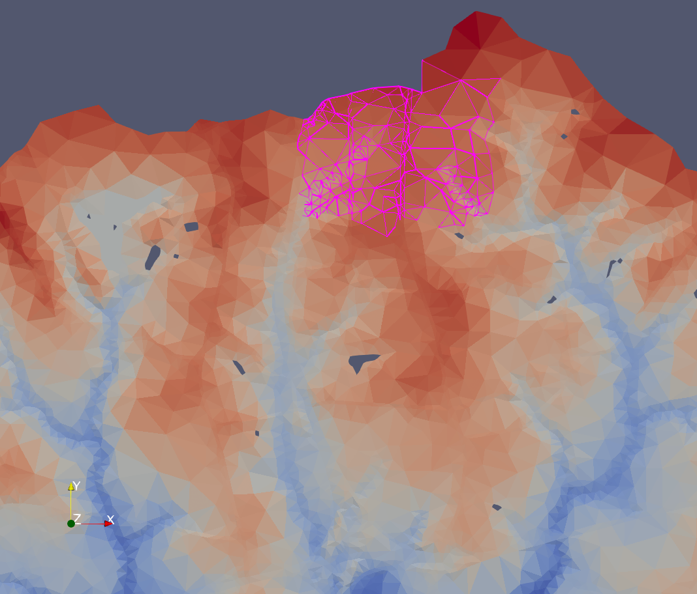
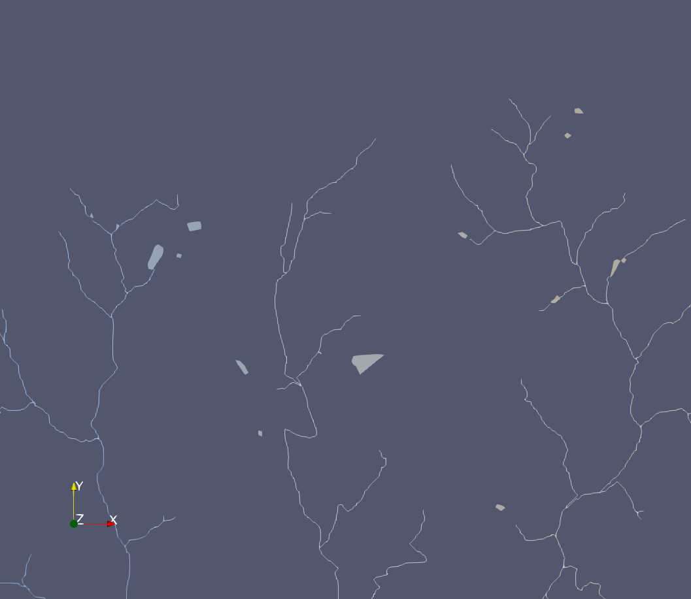

ADHydro Knowledge Capture

In this document I will attempt to record all of my knowledge about
ADHydro as a reference for other members of the project. I will assume
that you understand the overall purpose of ADHydro as a
hyper-resolution, physics-based watershed hydrology and hydraulics
simulation. If you need an introduction to this, it can be described at
a high level by other members of the project. I will further assume that
you understand the Charm++ system that we used to program ADHydro. The
Charm++ project has documentation that you can use to learn about
Charm++ in general (see the "Charm++ Tutorial" here
<http://charm.cs.illinois.edu/help>)

ADHydro can be seen as a system with three parts:

1.  Mesh creation workflow.
2.  The simulation engine consisting of flux calculator and integrator.
3.  Output processing and visualization using scripts and public-domain
    tools.

The workflow for mesh creation uses various tools and scripts. It is
somewhat ad hoc. We developed something that works for the source data
that we have been using, but will probably need to be modified if you
use different source data. For example, if you want to base your channel
network on the NHDPlus flowlines instead of a TauDEM stream network, you
will need to modify the scripts. The important thing for mesh creation
is the file formats. Any workflow that produces the proper file formats
can be read into the simulation engine and simulated.

The simulation engine itself is the majority of the Charm++ code. It is
the most significant part of what we have developed, and I will describe
it in detail below.

Output processing is also somewhat of an ad hoc set of visualization
tools like Paraview and QGIS plus scripts to make the simulation output
files viewable by those programs. I will not spend as much time talking
about mesh creation or output processing.

Details of how to access the repository, what's in there, and how it is
organized are given below in Appendix A: Locations of Files

ADHydro started with an NSF-funded project named "CI-WATER". The
objective of that 2012-2014 project was to "lower the bar" for
application of high performance computing for water resources
management. We started by writing a serial code. The purpose of this was
for me to learn the numerical method from Wencong Lai. Then we chose to
use Charm++ as the framework for our parallel version. The first
parallel version was primarily an exercise in learning how to use
Charm++ and applying it to our numerical method. This first parallel
version we called version 1.0, the serial version was not given a
version number. One distinctive feature of version 1.0 was that each
element was a separate Charm++ chare object. We saw the poor performance
implications of this and it resulted in changing to the system of
regions, described below, in version 2.0. The code for the serial
version and version 1.0 was in a CVS repository administered by
Professor Craig Douglas. I do not believe there is any reason to
preserve, even for reference, anything in the serial version or version
1.0. Version 2.0 completely supersedes them.

ADHydro currently has two active versions. Version 2.0 is a complete
runnable program that we have been doing our evaluation work with so
far. Version 3.0 is still in development. It is mostly complete. It has
all of the code to actually run the simulation, but it is missing code
to read and write input and output files so you can't initialize a mesh
from files. Currently, it has temporary code to run a hard-coded mesh
that has been used for debugging.

I would recommend looking at version 3.0 to learn about the simulation
and continuing development from the 3.0 codebase. It is a more advanced,
cleaner version that more clearly elaborates our concepts of how the
system should work. If you need to run a simulation today, you have to
use 2.0, but 2.0 should be retired when 3.0 is functional. The next
sections describe the architecture with references to the parts of the
code that implement various parts of the architecture. Following that
there is a discussion of specifically what needs to be done to implement
initialization from files to complete version 3.0.

Coding philosophy?

Listing of Routines with summary of purpose (in appendix)?

The Simulation Engine

Elements

Can you include an appendix that describes the element structure? The
element structure is well documented in mesh_element.h and
channel_element.h

An ADHydro simulation consists of a set of elements, and each element
has a set of neighbors. The defining characteristic of an element is
that it can store water. The defining characteristic of a neighbor
relationship is that two elements that are neighbors can exchange water.
In its simplest conceptualization, ADHydro is simply a bunch of buckets
of water trading water with each other.

ADHydro does have two types of elements, mesh and channel. Mesh elements
are 2D triangles that have overland and groundwater flow. Channel
elements are pseudo-1D flowlines that can form a branched or even cyclic
network. In addition to streams and rivers, waterbodies and glaciers are
also considered channel elements. Channel elements have surface water
only, but they can exchange water directly with the groundwater of
adjacent mesh elements. Essentially, the groundwater under a channel is
book-kept as groundwater of adjacent mesh elements.

 _Mesh Elements_

 _Channel Elements_

This distinction between mesh and channel elements is not an essential
part of ADHydro conceptually. What we'd really like to have is an
element superclass with subclasses for various types of elements and
virtual functions so that when the code calculates the water flow
between two elements whatever physics function is appropriate for the
types of those elements gets called.

However, that is not how the code is currently implemented. Charm++
migration has some complicated interactions with polymorphic objects so
we haven't tackled that yet. The distinction of two specific types of
elements, mesh and channel, is hard-coded in many places in the code.
Going to fully polymorphic elements is a possible path for the
arcitecture in the future. The primary benefit would be enabling
implementation of new types of water management structures where all
necessary functionality may not be easy to predict before encountering
an actual example as needed.

Time-Stepping Algorithm

ADHydro is an explicit first order simulation. This means that we first
calculate a flow rate between every pair of neighbors, and then we step
time forward having every pair of neighbors move a quantity of water
equal to the flow rate times the duration of the time step. Then we
calculate new flow rates, etc. The code for this time-stepping algorithm
can be divided into two parts: the physics code that calculates the
proper flow rates, and an "integration engine" that moves the water. We
call the second part an integration engine because it is effectively
calculating the integral of the flow rates. The code for these two parts
is well separated and encapsulated. Adding new types of elements and
flows should require only new physics code with changes to the
integration engine being minimal.

ADHydro has some optimizations to this simplistic description of the
time-stepping algorithm. Not everything moves in lock-step. Instead,
each pair of neighbors independently calculates an expiration time for
the flow rate between that pair of neighbors. Slow flows like
groundwater can be recalculated infrequently saving computation. Also,
different elements can advance their time independently as long as they
don't exceed their flow rate expiration times. If a rainfall event makes
a subset of the map slow down, the rest of the map can go on ahead and
when the rain stops that subset dries up, speeds up, and catches up
while a different subset of the map may be slow due to rain elsewhere.

A good description of the full time-stepping algorithm can be found in
the code repository in the doc directory in the file
ADHydro_multi_timestep_architecture.odp.

Regions

Elements are grouped into regions in the code. Regions have no
significance for the actual simulation algorithm. All interactions take
place between elements. Regions are simply a performance optimization.
The processing work for a single element is small. If each Charm++ chare
object contained only a single element then the overhead for the Charm++
system to "context switch" between chares would be large. Instead, each
chare object is a region which contains multiple elements. The core
simulation engine is agnostic to the number of regions and the number of
elements per region. However, what is most likely to produce the best
performance is to define regions around hydrologically connected
catchments.

The way the code currently assigns regions is the following: When
ADHydro reads its input files, if the allocation of elements to regions
is not specified in the input files it invokes a procedure to allocate
elements to regions. This is usually because you are reading a map for
the first time from ASCII files that do not specify regions. However, if
you are reading from NetCDF files and the parameter.nc file does not
have the region specifying variables in it, the same procedure will be
invoked. The code places in a single region all elements that have the
same value for meshCatchment (mesh elements) or channelReachCode
(channel elements) Since our current mesh creation procedure sets those
values to the TauDEM catchment number it results in each catchment
defined by TauDEM becoming a region. Waterbodies from the NHD waterbody
source data have their chanelReachCode set to the NHD reach code value.
This is different for every waterbody so each waterbody winds up alone
in a region by itself. Large waterbodies can have lots of neighbors so
this may be a good organization allowing the Charm++ load balancer lots
of flexibility for these highly connected elements, but small
waterbodies would probably be better to place in the region of the
catchment they are contained in. We have not explored optimizing this
region allocation procedure. The region allocation can be changed on an
existing map by changing values in the parameter.nc file.

To make the best use of Charm++ load balancing, the number of regions
should be at least several times the number of processing elements
(cores), and the number of inter-region neighbors should be minimized.
We have found that at fewer than 3 regions per core the scalability of
the run-time performance seems to degrade. Often performance is limited
by a few bottleneck regions that are slow and wind up running on a core
by themselves. This slowness can sometimes be caused by awkward geometry
situations in the map that can be fixed by hand. For example, small
triangles or topography resulting in deep ponded water. I have found
that a best practice on a new map is to find the elements with the
smallest timesteps and look at those locations to see if something can
be fixed.

I would start to look at the code by looking at the region.ci file and
referring to the region.h and region.cpp files as necessary. The
region.ci file has Charm++ structured dagger code that basically lays
out the overall operation of the simulation. The .h and .cpp files have
the functions that implement the high level actions listed in the .ci
file.

The region constructor does very little itself. It's main job is to
start off the runUntilSimulationEnd() function that does everything. The
runUntilSimulationEnd() function starts by initializing the mesh and
channel element objects it needs. It receives a message from the
initialization manager telling it how many elements to expect, and then
a separate message with the data for each element. As it receives each
element it sends out messages to each of that element's neighbors to
initialize "neighbor proxies". Essentially, each element stores a proxy
with information about each of its neighbors, and this is how that
information gets initialized. Then it waits until all of the neighbor
proxy messages are received. You will notice in region.ci line 106 that
the neighbor proxy messages are received by a function called
receiveMessages that is used elsewhere to receive other kinds of
messages as well. This is a polymorphic implementation that hands the
message object a reference to the element that the message is for and
tells the message to call the correct receive function on the element.

Once all neighbor proxy messages are received, initialization is done
and the program enters its main loop, which is the line "while
(currentTime \< simulationEndTime)" in region.ci. The first thing in
this loop is the invariant check. Invariants are a software technique
for detecting bugs. Certain things in the code should always be true.
For example, the amount of water in an element should never be negative,
two neighbors should always agree on the amount of water flowing between
them, etc. The invariant check checks these things to make sure they are
true. The invariant does not accomplish any part of the simulation. It
is an auxiliary self-check that is just there in case the code has bugs.
This invariant check requires a round of messages so that relationships
between elements and their neighbors can be checked.

After the invariant check, elements receive forcing data. Each element
stores values such as temperature, humidity, and precipitation rate that
are inputs to the simulation that can vary per-element. These values are
periodically updated, for example every hour of simulation time. The
values stored at each element are updated at the right time, and then
between updates each element uses its stored values for the individual
timesteps. For I/O efficiency, there is a separate part of the system
called the forcing manager that reads the forcing data from file and
sends out Charm++ messages to the regions that forward the data to the
elements.

For efficiency, you really want to read ahead in the forcing data so
that the data is available as soon as an element needs it and you never
have to wait for forcing data. But you need to prevent an element's
forcing data from being updated too soon. The way we handle this is
every forcing message is tagged with the simulation time it should be
used. Regions refuse to receive a forcing message until they get to the
right simulation time. Regions also send a ready message back to the
forcing manager to tell it to read ahead. When the first region to start
using an instance of forcing data sends a "readyForForcing" message the
forcing manager starts reading the next instance.

The rest of the main loop is the time-stepping algorithm described in
ADHydro_multi_timestep_architecture.odp. The numbered steps described in
the document are included in the comments in the code. Interactions take
place between elements with regions looping over all of their elements.
Regions also aggregate messages for efficiency. In a particular step
there may be many elements in a single region sending messages to
elements in a single other region. Instead of having each element send a
separate Charm++ message, the elements append messages to a vector, and
the region sends the vector in a single Charm++ message to the other
region. At the destination, the region object unpacks the vector and
forwards the messages to the elements. Each logical "send" by an element
results in one call to "receiveMessage" at the destination element, but
with fewer Charm++ messages going between the regions.

Region.cpp/h, Mesh_element.cpp/h, Chanel_element.cpp/h

The Region class in region.cpp/h has the variables for keeping time. All
elements within a region step time forward in lock-step. They are always
at the same simulated time and always use the same timestep. Different
regions can be ahead or behind each other in simulated time. Therefore,
the region objects are the entities responsible for time. The variable
currentTime keeps track of the current simulated time of the region.
Each time through the time loop a new value for timestepEndTime is
selected, and at the end of the time loop currentTime is advanced to
timestepEndTime.

The Region class also keeps track of some synchronization points. All
elements get new forcing data at simulation times specified in the
forcing file so Region keeps track of the next time it will receive
forcing data in the variable nextForcingTime. To output a checkpoint,
all elements must stop and report their state at a common synchronized
point in simulation time. Region keeps track of this point in the
variable nextCheckpointIndex. The simulation time for this index is
found by calling Readonly::getCheckpointTime(nextCheckpointIndex).
Finally, the region has a variable simulationEndTime for the simulation
time to end the run.

All regions will have a timestep end at each of these synchronization
points: nextForcingTime, nextCheckpointIndex and simulationEndTime. At
that point, the appropriate action is taken, either receiving forcing
data, sending element state for a checkpoint, or exiting the main loop
at the end of the simulation. It is important to note that regions do
not have to hit these synchronization points at the same wall clock
time. For example, when a region hits a checkpoint time it sends element
state and continues on simulating without waiting for other regions to
hit the same checkpoint time. The checkpoint manager (discussed below)
waits until it receives state from all regions for that checkpoint and
then writes out the checkpoint. It is a nominal synchronization in
simulated time, not an actual synchronization in wall clock time. This
does mean that a checkpoint manager may have to manage multiple half
filled in sets of checkpoint data for different simulation times. This
is all handled in the code.

Other than keeping track of time, for most of its functionality the
Region class is a passthrough to functionality in the MehsElement and
ChannelElement classes.

The element classes, MeshElement in mesh_element.cpp/h and
ChannelElement in channel_element.cpp/h, contain several things. First,
they contain member variables for the attributes of the element. These
are such things as element geometry, hydraulic parameters such as
manning's N, and state variables for where the water is: surfacwater
depth, water table head, soil moisture, etc. Second, they contain a set
of NeighborProxy objects, one for each neighbor relationship. These
objects will be discussed below. Third, they contain the code for
actually moving the water.

Water can move internally within an element, or between element
neighbors. Each element represents a 1D column with various stations
where water can exist such as: intercepted by the canopy, in the
snowpack, as surfacewater runoff, as groundwater in the soil, and as
groundwater in the deeper aquifer. 1D vertical processes that move water
between these stations such as snowmelt or infiltration are done
entirely within a single element and require no communication. 2D
horizontal processes of overland flow and groundwater flow are handled
by rounds of messages between neighboring elements. One part of 2D
horizontal flow is not implemented in the element classes, and that is
the calculation of flow rates. Functions for the physics equations to
calculate flow rates are broken out into their own .cpp files, and the
NeighborProxy objects decide which of those physics functions to call
based on the type of neighbor relationship, e.g. groundwater flow for
groundwater neighbors and surfacewater flow for surfacewater neighbors.

The most significant function in mesh_element.cpp and
channel_element.cpp is doPointProcessesAndSendOutflows. This handles the
1D water movements and sends water to neighbors based on previously
calculated flow rates. The second most significant function is
receiveInflowsAndUpdateState which is called at the end of the timestep
to resolve all of the water that was in transit during the timestep.
Much of this code handles moving groundwater and updating the water
table head. A description and pseudocode for the groundwater model is in
the code repository in the doc directory in the file
[ADHydro_groundwater_model.md](ADHydro_groundwater_model.md). The rest of the code in mesh_element.cpp
and channel_element.cpp is small helper functions or passthroughs to the
neighbor proxies.

Neighbor_proxy.cpp/h

The NeighborProxy class represents a neighbor relationship. The first
thing to look at is NeighborEndpointEnum and NeighborConnection in
neighbor_proxy.h. A NeighborConnection tells you what is connected to
what. NeighborEndpointEnum is simply an enum of connection types used by
NeighborConnection. For example, a NeighborConnection with the values
{MESH_SOIL, 13, CHANNEL_SURFACE, 25} would mean that the soil of mesh
element 13 is connected to the surfacewater of channel element 25. This
would represent direct infiltration or exfiltration between a channel
and the soil of the channel bank. Both directions of flow are handled by
a single NeighborProxy. There would probably also be a
NeighborConnection with the values {MESH_SURFACE, 13, CHANNEL_SURFACE,
25} meaning the surfacewater of mesh element 13 is connected to the
surfacewater of channel element 25. This would represent surfacewater
runoff into the channel or over bank flow out of the channel.

So neighbor relationships are stored at finer grain than just mesh
element 13 is connected to channel element 25. There are several reasons
for this. First, not all standard connections exist in all situations. A
mesh element may have no soil if it is an exposed aquifer or exposed
bedrock. Then the surface connection could exist without a soil
connection. Second, each separate connection represents a separate flow.
Each flow uses different physics equations for surfacewater or
groundwater, and each flow needs separate variables to store the flow
rate, cumulative flows, etc. The ADHydro architecture handles this by
having each NeighborProxy object have variables for just one flow with
the possibility of multiple NeighborProxy objects between the same two
elements representing different types of flow.

Next, there are classes for the different types of messages exchanged
between elements. Most of the work of sending and receiving messages is
actually done by the neighbor proxies because they have the information
that identifies who the neighbor is. There are three classes that are
"payload" classes that get wrapped in a "message" class. The payload
classes are: NeighborAttributes contains unchanging attributes of an
element that are cached at the remote neighbor for use in calculations.
NeighborAttributes messages are exchanged during initialization.
WaterTransfer contains water that is being sent from one element to
another. NeighborState contains state that must be included in a
checkpoint.

The message classes occur at the bottom of neighbor_proxy.h below the
NeighborProxy class because of declaration order issues. There are 5
message classes. The class Message is a pure virtual superclass that
exists merely to allow all message types to be handled with common code
at the region and element level. NeighborMessage wraps a
NeighborAttributes. WaterMessage wraps a WaterTransfer. A StateMessage
sends information about the water level in an element to allow
calculation of flows. It turns out that for a single flow, only one
number is ever needed, either the surfacewater depth for surface flows,
or the water table head for underground flows. Therefore, the payload of
a StateMessage is a single variable and we didn't feel it necessary to
have a separate payload class for this data. An InvariantMessage is sent
when checking the invariant. Two neighboring elements should agree about
certain things like the flow rate between them. This is checked in the
invariant and doing so requires sending a message between the elements.
The payload of the message is actually a copy of the entire
NeighborProxy object. The NeighborState payload class is packed into a
MeshState or ChannelState object and sent by the Region object to the
checkpoint manager. Therefore, there is no message class with a
NeighborState payload in neighbor_proxy.cpp/h.

The final thing in neighbor_proxy.cpp/h is the NeighborProxy class
itself. For each neighbor relationship there will be two NeighborProxy
objects, one stored at each of the neighboring elements. Duplicate
information will be cached in both of these objects, but since the
elements might be in different regions on different processors having
the duplicate information locally is important for minimizing
communication.

There are three important functions in Neighbor Proxy that calculate
flow rates: calculateNominalFlowRate, receiveStateMessage, and the
private helper function nominalFlowRateCalculation. Some flow rates can
be calculated without communication, for example inflow and outflow
boundary conditions. Some flow rates can be calculated with information
on the same processor that can be accessed through shared memory, for
example when neighbors are in the same region. But other flow rates
require messages to be sent between neighbors on different processors.
An element starts by calling calculateNominalFlowRate on all of its
neighbor proxies. This calculates the flow rate if possible, and if not
possible sends a state message to the neighbor. Then, when the state
message is received, receiveStateMessage is called and the flow rate
calculation takes place now that all necessary information is available.
Behind the scenes, both calculateNominalFlowRate and receiveStateMessage
call nominalFlowRateCalculation to do the calculation.

Note that both neighbors send state messages and both neighbors
calculate the flow rate. Both call the exact same code with the exact
same inputs so they are guaranteed to result in the exact same value for
the flow rate. We felt the performance would be superior with this
architecture rather than having one neighbor send its state followed by
the other neighbor calculating the flow rate and sending back the flow
rate. That would be two serial messages rather than two parallel
messages although the parallel architecture does require two
computations instead of one.

Surfacewater.cpp/h and groundwater.cpp/h

These files contain the physics equations for calculating flow rates for
all situations. They are broken out into separate files to make them
modular and more easily replaced if one wishes to use the ADHydro
integration engine with different physics equations. This document is
about describing ADHydro from a software architecture point of view so
I'm not going to go into the math that models the physics. From a
software point of view, you call a function passing in geometry,
hydraulic parameters, and water levels, and it returns a number for the
flow rate in cubic meters per second.

The set of objects described up to now: regions, elements, neighbor
proxies, and physics equations, are basically the whole core of the
ADHydro simulation engine. Everything else is somewhat auxiliary odds
and ends, but will be described below.

Simple_vadose_zone.cpp/h, garto.cpp/h

These are modules that represent soil moisture state. Garto.cpp/h has
not yet been migrated into the version 3.0 code, so it only exists in
the version 2.0 directory. I think the code in garto.cpp/h could use
quite a bit of rewriting so I put off migrating it.
Simple_vadose_zone.cpp/h is a more trivial representation of soil
moisture state. The long term idea is that soil moisture state
representation and corresponding infiltration code will be a swappable
module with a variety of methods available for use. We are pretty close
to that. The main stumbling block has been how do we provide a modular
interface for storing the state variables of an unknown new model in a
NetCDF file. Version 3.0 tackles this by having object state be saved to
an opaque blob using the Charm++ pup framework, and having that opaque
blob stored in the NetCDF file. The object can then be restored using
pup. I think this is a good architecture, but it hasn't been tested
much.

Evapo_transpiration.cpp/h

This file is a wrapper of Noah-MP. We use Noah-MP for certain 1D
processes such as canopy interception and snowmelt. We used Noah-MP in a
way that its developers hadn't really intended. The Noah-MP code is
designed to be a main program, and we are using it as a library called
from our main program. So we are calling in to what they consider an
internal function, and so documentation of the interface is not as
thorough. Mostly as an exercise to learn how to use the interface, I
wrote a big mass balance check around Noah-MP. This was very helpful and
showed us many times where we were using the interface incorrectly, or
interpreting the meaning of variables incorrectly because of the limited
documentation. Also, there are some parts of Noah-MP that we are not
using, such as the soil moisture calculation. We have to fill in the
Noah-MP soil moisture variables from our soil moisture state variables
before each call, and then we throw away the results that Noah-MP
reports.

We also wish to make a modular interface for these 1D processes just
like for soil moisture state. This wrapper helps makes Noah-MP more of
an isolated module that would be easier to replace.

Forcing_manager.cpp/h

The ForcingManager class is a Charm++ group, that is, there is exactly
one object instance on each processor. Forcing data is read from NetCDF
files. For the parallel NetCDF library we are using, I/O is most
efficient when accessed as contiguous blocks striped across processors.
So processor 1 reads the forcing for elements 1 to N, processor 2 reads
N+1 to 2N, etc. However, elements 1 to N are probably scattered across
different regions on different processors. So the forcing manager is
just a helper that reads contiguous blocks, reshuffles the data, and
sends the correct data to the correct region in Charm++ messages.

There is one cute trick we do to minimize wait time for forcing data.
Our forcing is a static input to our code so it can be read ahead of
time as early as we want. The forcing manager is always one forcing
instance ahead of the furthest ahead region. When a region says it is
ready for forcing data instance N the forcing managers will stat reading
N+1 if they haven't already.

Checkpoint_manager.cpp/h

The CheckpointManager class handles saving checkpoints. It is very
similar to the ForcingManager class in that it is a Charm++ group, and
for the same reasons. We want to output all of the data for a single
checkpoint at once striped across processors. Checkpoint data for
individual elements is sent to the CheckpointManager as regions reach
the checkpoint simulation time. When a complete set of data is present
it gets written out.

Initialization_manager.cpp/h

The InitializationManager class is yet another Charm++ group that
handles initializing the simulation from file. It is not complete and
will be discussed below in the section "Items Remaining to finish
Verison 3.0".

Map_geometry.h, Map_parameters.h, Time_point_state.cpp/h,
File_manager_NetCDF.cpp/h

These are I/O helper classes. map_geometry.h, map_parameters.h, and
time_point_state.cpp/h are data structures that store information that
must be read or written to NetCDF files. map_geometry.h and
map_parameters.h are only used by the InitializationManager for reading,
while time_point_state.cpp/h is used by both the InitializationManager
and the CheckpointManager. It has some functionality that map_geometry.h
and map_parameters.h don't need because the CheckpointManager has to
store partially filled in states as it receives messages from regions.

File_manager_NetCDF.cpp/h is just a collection of wrappers for NetCDF
functions to take the uber flexible NetCDF interface and simplify it to
just what we use.

Readonly.cpp/h

This is a set of global variables that get replicated to all processes
by Charm++, and a set of static helper functions that don't fit anywhere
else. It was made its own class that depends on nothing else because it
is included in so many places it was causing dependency loops.

Adhydro.cpp/h

This is the mainchare of Charm++, i.e. the entry point for the main
program. Pretty much all it does is read parameters from the command
line and create the region objects and the three manager groups. Then
those objects do everything else.

Items Remaining to finish Verson 3.0

The primary thing to finish on version 3.0 is the initialization
manager. The initialization manager works in two steps. First, data
needs to be read in from file into MapGeometry, MapParameters, and
TimePointState objects. Second, those objects are used to send messages
to regions with all of the element data. This second part is done. In
InitializationManager::initializeSimulation starting at line 1091 (//
Notify regions of how many elements they will be receiving.) to the end
of the file, the code is complete. If you have filled in MapGeometry,
MapParameters, and TimePointState objects at that point in the code the
simulation will be properly initialized and will run. Also, there is a
function, initializeHardcodedMap, that is meant as a temporary testing
harness. It fills hardcoded values for a valid mesh into MapGeometry,
MapParameters, and TimePointState objects.

The one thing that probably should be done to that part of the code
would be to pull it out in a separate method. When I was first writing
it I didn't realize the two step nature of the process. It would be nice
to have the two steps encapsulated into two separate methods.

For the first step, there are two separate cases that need to be
handled. The code needs to be able to read NetCDF files and ASCII files.
Our design is that we read from NetCDF files and write to NetCDF files,
and our output files are the exact same format as our input files so
that any output is a checkpoint that can be used as input to hot start a
new simulation. However, the result of the map creation workflow is a
set of ASCII files. The ASCII files do not contain all of the data
needed to run a simulation so they are not a good choice for the primary
file format to store a map.

There are two procedures that must be implemented. One is to read a set
of ASCII files, apply defaults for missing data, and output a set of
NetCDF files. The second is to read NetCDF files and start the
simulation. In version 2.0 of ADHydro I made it so that these two
options were very parallel. You could start a simulation from ASCII
files plus defaults if you want. And you could use the procedure for
filling in defaults if your NetCDF files were missing data. But there
has never been any reason why we would want to. I'm now thinking that
the right way to do this would be to completely separate them, maybe
even into two separate executables.

You could just have an ASCII to NetCDF conversion utility and the
ADHydro main program can only read NetCDF files. The one reason this
seems like it might be a bad idea is because there will be some code
overlap in the fact that both will be writing NetCDF files, and both
will be handling similar data and so use similar data structures. So
maybe the best option is a single ADHydro main program with two modes,
one that doesn\'t run the sim, just reads ASCII and writes NetCDF, and
one that does run the sim and just reads NetCDF. One final option would
be to have an ASCII to NetCDF conversion utility that just creates a
"cold start" set of files with just geometry.nc and parameter.nc, and no
state.nc. The main simulation really has no reason for writing
geometry.nc and parameter.nc. It just reads them and checkpoints only
require writing state.nc. This may leave very little common code between
the two. Then the main ADHydro program would need a cold start mode
where if state.nc is missing it uses defaults, but state.nc has the most
obvious and least problematic default values.

Note on our file formats: Geometry.nc holds geometric data about
elements: X,Y, Z coordinates, size, length, things like that. These do
not change during a simulation so a simulation needs a geometry.nc file
as input, but there is no need to generate a geometry.nc file as output
as it will be identical to the input file. Parameter.nc holds
non-geometric parameters like soil porosity, what region each element is
in, etc. These also do not change so a run does not need to output a
parameter.nc file. State.nc just stores where the water is: surfacewater
depth, soil moisture, etc. It is the only thing that needs to be output
to represent the system at different times. In version 2.0 we had
another file display.nc. This was a subset of state.nc. We hoped it
would be faster to write so when you wanted to look at some of the
state, but didn't need a restartable checkpoint you could get them
faster. It was a little faster, but not much. We don't plan to have a
display.nc in version 3.0.

In verison 2.0 we made use of unlimited dimensions in NetCDF files. We
were thinking that multiple time points could be stored in a single
state.nc file along a "time" dimension and that dimension could be
unlimited so you could extend your sim arbitrarily as you like. This
seems like it was a bad idea. The performance of reading and writing
files with unlimited dimensions is BAD. For version 3.0, instead we are
storing each time point as a separate file with all dimensions fixed.
For state.nc files this has been implemented in the checkpoint manager.
When you look at the version 2.0 code for geometry.nc and parameter.nc
files don't follow it too closely. Follow the pattern in the version 3.0
checkpoint manager and don't have an "instance" dimension in the netCDF
files.

Another thing we were thinking of doing with unlimited dimensions was
mesh adaption. If you split up some triangles to have higher resolution
in a particular place temporarily and then you want to checkpoint that
how do you do it? We were thinking that the geometry.nc and parameter.nc
files would have extra instances with the changed meshes, and since we
didn't know how many of these instances we might create we used
unlimited dimensions.

We have never gotten to doing adaption. We do not have a design for how
we would do adaption. We have some hand-wavey ideas of how we might like
it to work, but not a design with enough detail that you could implement
it. If you ever do get around to doing adaption you will have to come up
with a design. Whatever you do, DON'T use unlimited dimensions on
NetCDFfiles.

Another note: The data structures MapGeometry, MapParameters, and
TimePointState have the variables they need to start a simulation. They
do not have all of the variables that were in the version 2.0 file
manager. Some of those variables came from ASCII files, but weren't
really used, or were only used to derive other variables. For example,
the ASCII files have only the vertices of elements, but the simulation
uses only element centers. You may have to extend those data structures,
but don't feel too beholden to what was done in version 2.0.

To implement reading/writing ASCII and NetCDF files you can look at the
version 2.0 code in file_manager.cpp/h. This file did everything that in
version 3.0 has now been broken out into the three separate managers:
initialization, forcing, and checkpoint, plus the helper functions in
file_manager_NetCDF.cpp/h and some things that got moved to
readonly.cpp/h so version 2.0 file_manager.cpp/h is large and unwieldy.

For reading ASCII files, you want to look at the following methods:

readNodeAndZFiles

initializeFromASCIIFiles

After reading the ASCII files we applied defaults and some automated
fixes for things like digital dams. We called this ad-hoc set of things
"mesh massage". For this, look at the following methods:

meshMassageVegetationAndSoilType

breakMeshDigitalDam

findDownstreamChannelElement

breakChannelDigitalDam

meshMassage

calculateDerivedValues

For writing out geometry.nc and parameter.nc files look at the following
methods:

NetCDFCreateInstances

NetCDFCreateDimension

NetCDFCreateVariable

NetCDFWriteVariable

NetCDFCreateOrOpenForWrite

NetCDFCreateOrOpenForWriteGeometry

NetCDFCreateOrOpenForWriteParameter

NetCDFWriteGeometry

NetCDFWriteParameter

writeNetCDFFiles

For reading NetCDF files, you want to look at the following methods:

NetCDFOpenForRead

NetCDFReadDimensionSize

NetCDFReadVariable

NetCDFReadInstances

NetCDFReadGeometry

NetCDFReadParameter

NetCDFReadState

initializeFromNetCDFFiles

The initialization manager is the only thing that needs to be done to
make version 3.0 usable. Other things that could be done are:

Migrate garto to 3.0.

New NetCDF file formats will require changes to output visulaization
scripts.

2.0 had a mass balance check as a built-in Charm++ reduction. There was
some problem, either we were using Charm++ wrong, or a bug in Charm++,
the reduction would stop working intermittently, and I could never debug
it. Having a built-in on-line reduction was neat, but mass balance could
also be checked off-line by adding up water quantities and cumulative
flows stored in a checkpoint file.

User's guide documentation beyond code comments and a few powerpoints
could be written.

I'm sure there's plenty of room for performance optimization.

There are comments in the code labeled FIXME and FIXLATER for high and
low priority things to look at and possibly fix.

Appendix A: Locations of files

The ADHydro codebase is checked in to a github git repository. 

```sh
git clone https://github.com/noaa-owp/adhydro
```

Within the git repository there are several top-level directories:

The scripts and util directories contain little utility programs/scripts
that deal with mesh creation or output processing. Things that are
python scripts are in the scripts directory, and things that are
C/C++/Charm++ programs are in the util directory.

The ref directory contains deprecated pieces of code that we are keeping
for reference.

The management directory contains the water management code. This
handles things like reservoir releases and diversions. Nels wrote this
code and understands it better than I do.

The input directory contains example input files. Right now, it contains
a superfile for code version 2.0, and a separate one for version 3.0
that is being developed in parallel with the code that reads it. A
superfile is the single input file that you give to ADHydro on the
command line. It contains all of the run-time options including the
locations of other input files.

The inih directory contains a small free software .ini file reader
library that is used in the ADHydro code to read the superfile. It was
not developed by this project.

The HRLDAS-v3.6 directory contains Noah-MP. We got this source code
snapshot (version 3.6 of Noah-MP) at a point in time. Since then, we
have made a few modifications that were necessary to make Noah-MP work
as a library called from our code instead of a main program. This code
is basically completely forked from whatever main-line development there
is on Noah-MP.

The doc directory contains project documentation. I would recommend
reading everything in this directory.

The directory ADHydro contains version 2.0 of the ADHydro code. This is
the main released version of the code.

The directory ADHydro_3.0 contains the development version 3.0 of the
ADHydro
code.
