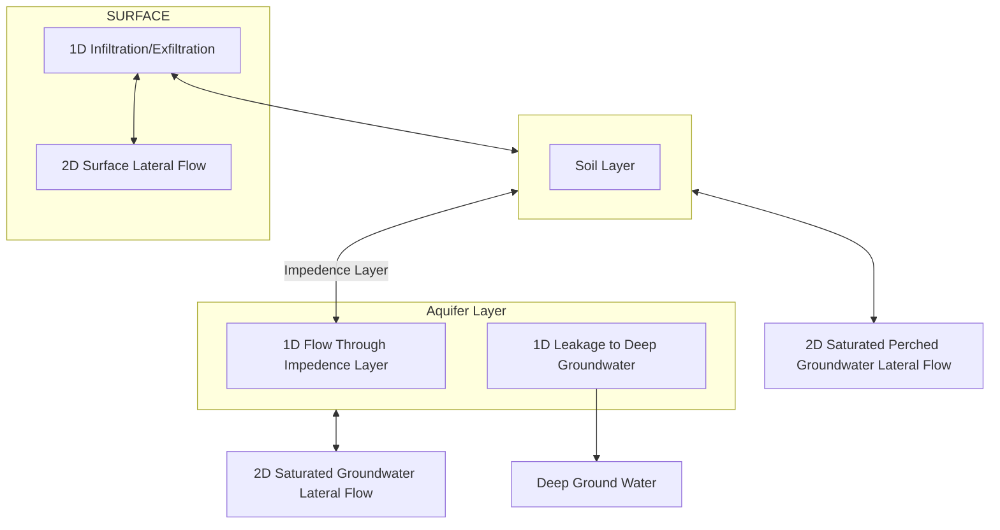
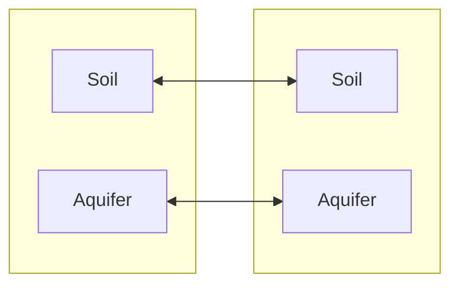
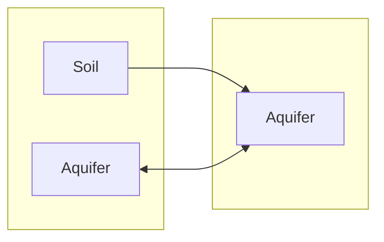
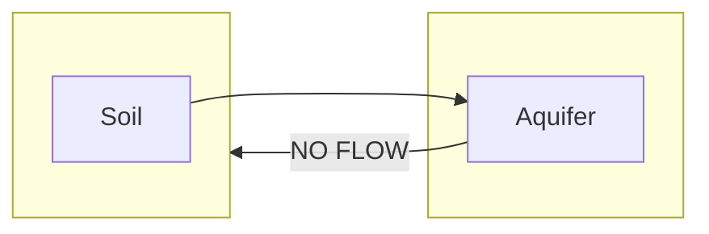
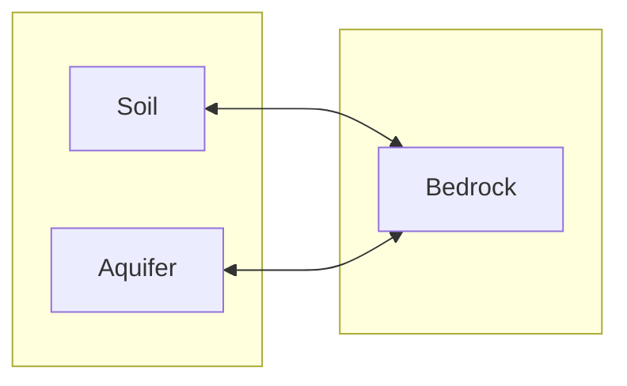

ADHydro Groundwater Model

ADHydro is a quasi three-dimensional model that simulates the movement
of subsurface water with 1D vertical flows and 2D lateral flows. We
neglect lateral unsaturated flows. There are three primary components in
the model: a soil layer, an impedance layer, and an aquifer layer. The
diagram below shows the relationship of the layers and possible flow
paths.

1\) Soil Layer

The soil layer is intended to model the A and B soil horizons. Hydraulic
conductivity generally decreases with depth, and can be exceeded by the
rainfall rate leading to either infiltration excess runoff if the
rainfall rate exceeds the infiltration capacity of the soil layer, or
saturation excess runoff by the creation of a perched water table at the
impedance layer. In the soil layer we model the vertical soil moisture
content profile in detail because it affects infiltration rate,
infiltration excess runoff, and the creation of perched water tables.
The soil moisture content profile cannot be guaranteed to be in
hydrostatic equilibrium due to the effects of recent inputs of water and
uptake by plants or evaporation. We combine the A and B horizon into one
hydraulically active "soil" that has one set of properties.

2\) Impedance Layer

The impedance layer is intended to model the C horizon of soil, which is
assumed to have a smaller hydraulic conductivity than the A/B horizon.
It behaves to limit the rate of percolation to the aquifer layer.

3\) Aquifer Layer

The aquifer layer models alluvial deposits with hydraulic connectivity
to streams. These tend not to produce infiltration excess runoff or
perched water tables partly because of high hydraulic conductivity and
partly because conditions of high rainfall quickly lead to saturation
when the water table is near the land surface. In the aquifer layer we
model the vertical soil moisture content profile in less detail. The
aquifer layer can provide water to the soil layer to satisfy ET demands.

Model details

In each computational element the soil layer can be either present or
absent, and the aquifer layer can be either present or absent. The
impedance layer is present if either the soil layer or the aquifer layer
is present. The vertical arrangement of layers is always the same for
any layers that are present: soil on top, impedance layer next, aquifer
layer on the bottom. We will start by discussing the most common case of
an element with all layers present. Other cases are discussed below.

The soil layer is modeled as a thickness of soil with uniform
properties, such as porosity, water-retention characteristics and
saturated hydraulic conductivity. The water contained in the soil layer
is modeled with a 1D vertical vadose zone moisture content solver. This
solver could be one of several methods such as Talbot-Ogden, GARTO, or
Richards\' equation. The upper boundary condition for this solver can
either be a specified flux, or if ponded, a specified head. If ponded,
no more than the total amount of ponded water can infiltrate. The soil
layer contains the root zone, and transpiration demand is taken from the
soil layer.

The impedance layer is modeled as having zero thickness and containing
no water for the purpose of the mass balance calculation. The impedance
layer provides a maximum flux boundary condition at the bottom of the
soil layer and top of the aquifer. Initially, the soil is simulated with
a hydrostatic head boundary condition where the head is equal to the
level of the water table in the aquifer layer. However, if that boundary
condition would cause a flux through the impedance layer greater than
its hydraulic conductivity it becomes a flux boundary condition limited
to that flux. In this case a perched water table is created. The level
of the water table in the perched water table is then tracked separately
from the water table in the aquifer layer. When the flux through the
impedance boundary falls below the maximum limit, or if the level of the
water table in the perched water table falls below that of the aquifer,
the perched water table ceases to exist and the impedance boundary
returns to a head boundary condition governed by the aquifer water
table.

The aquifer layer is also modeled as a porous medium with uniform
properties. The properties can be different than the soil layer. The
water contained in the aquifer layer is modeled with a simplified 1D
vertical moisture content solver. Only the groundwater capillary fringe
moisture profile is simulated. Any water that percolates from above is
assumed to go immediately to aquifer recharge. At the top of the aquifer
layer there is a flux boundary condition through the impedance layer
implemented as a three step handshake. First, the soil layer\'s vadose
zone solver is run and any water that makes it through the impedance
boundary is added to aquifer recharge. Leakage to deep groundwater and
any 2D lateral flows with the aquifer\'s neighbors are also added to or
subtracted from aquifer recharge. The deep leakage flux boundary
condition at the bottom of the aquifer can be set to zero to model
impervious bedrock at the bottom of the aquifer. Second, aquifer
recharge is placed in the groundwater capillary fringe moisture profile.
Third, if that water completely fills the aquifer, any excess is handed
back to the soil layer to be added back in to its soil moisture. Any
upward flux from the aquifer to the soil is not limited by the
conductivity of the impedance layer as this would create a confined
aquifer, which we are choosing not to model.

The above describes the case where an element has both soil and aquifer.
The following describes all other possible cases and the differences
from the above description that arise in those cases.

An element can have soil and no aquifer. This models two possible
situations. One is that the aquifer below the soil is not hydraulically
connected to any stream, and therefore will not affect the outcome of
the simulation in any meaningful way. In that case, any leakage below
the impedance boundary is sent directly to deep groundwater. The other
case is that soil lies directly over bedrock and there really is no
aquifer. In that case, the hydraulic conductivity of the impedance layer
at the bottom of the soil is set to zero.

An element can have an aquifer and no soil. This models two possible
situations. One is alluvial deposits directly exposed at the surface
usually near streams. The other is a thin, low conductivity or even
impervious layer such as a parking lot or roadway atop an aquifer. Both
of these cases are handled in the same way. Infiltration and
exfiltration are handled through a trivial mechanism where the maximum
flux of the impedance layer is specified and water infiltrates up to
that maximum flux directly in to the aquifer. Any water that infiltrates
is simply added to the groundwater recharge in the aquifer without
simulating an infiltration front in the soil moisture content solver. If
the aquifer becomes full any excess water exfiltrates directly on to the
surface and rainfall on this surface becomes surface water. If the
aquifer is directly exposed at the surface this is modeled by setting
the maximum flux of the impedance layer equal to the conductivity of the
aquifer. If there is a low conductivity layer on top of the aquifer the
maximum flux of the impedance layer can be set lower. If the aquifer has
a completely impervious layer above it the maximum flux of the impedance
layer can be set to zero. Zero maximum flux in the impedance layer will
not prevent exfiltration from a saturated aquifer on to the surface.
Once again, this would create a confined aquifer, which we are choosing
not to model. Instead, we assume there are cracks in the impervious
layer which do not provide significant infiltration, but do not entirely
prevent exfiltration.

An element can have neither soil nor aquifer. This models a situation
where impervious bedrock is directly exposed at the surface. In this
case there is no infiltration and no subsurface water and rainfall on
this surface becomes surface water.

2D lateral flows

2D lateral flows can occur between soils and aquifers of neighboring
elements. In our model, we neglect unsaturated lateral flows in the
vadose zone. Lateral flows only occur in water under positive pressure,
i.e. below the water table. In particular, this means that we do not
calculate lateral flow for the soil layer when there is no perched water
table. If the aquifer is saturated and the aquifer water table is up in
the soil layer we simply calculate lateral flow for the aquifer adding
any saturated thickness in the soil layer to the thickness of the
aquifer. This assumption is justified because usually alluvial aquifer
conductivities are often much higher (1-100 m/d) than soils (0.24 to 2.4
m/d).

If two neighbors both have soil layers then lateral flow from one soil
layer goes to the neighbor\'s soil layer. Likewise, if two neighbors
both have aquifers then lateral flow from one aquifer goes to the
neighbor\'s aquifer.

If one element has soil and its neighbor does not have soil, but does
have an aquifer then water can flow from the soil to the neighbor\'s
aquifer if the soil has a perched water table higher than the
neighbor\'s aquifer water table. In that situation, water is not allowed
to flow from the neighbor\'s aquifer directly back into the soil.
Instead, flows in the reverse direction would go from aquifer to
aquifer. If the element with the soil has no aquifer then no flow in the
reverse direction is allowed into the soil because of the likely large
discrepancy in saturated hydraulic conductivity in soil. Water can still
flow overland in the reverse direction and then infiltrate into the
soil.

If one element has an aquifer and its neighbor does not have an aquifer,
but does have soil then as mentioned above no flow is allowed from the
aquifer to the neighbor, except overland flow.

If one element has soil and/or an aquifer and its neighbor has neither
soil nor aquifer then water can flow from the soil and/or aquifer to the
neighbor\'s surface if the soil or the aquifer's water table is higher
than the neighbor's surface. In the case of soil or aquifer exposed at a
cut bank to ponded water on bedrock, then the exchange of water is also
allowed from the neighbor\'s surface directly back into the soil or
aquifer depending on the difference in elevation between the water table
and surface water.

Pseudocode

Variables:

surfaceWater -- depth of ponded surface water

groundwaterMode -- can be SATURATED_AQUIFER (implies no perched water
table), UNSATURATED_AQUIFER (implies no perched water table),
PERCHED_WATER_TABLE (implies unsaturated aquifer), or NO_MULTILAYER
(used if soil and/or aquifer don't exist)

soilExists -- boolean flag if soil layer exists

perchedHead -- head of perched water table, only valid when
groundwaterMode is PERCHED_WATER_TABLE

soilWater -- data structure containing moisture content in soil layer

soilRecharge -- temporary holding bucket for water that is moving
to/from soil

aquiferExists -- boolean flag is aquifer layer exists

aquiferHead -- head of aquifer water table

aquiferWater -- data structure containing moisture content in aquifer

aquiferRechage-- temporary holding bucket for water that is moving
to/from aquifer

Subroutines:

updateHead(inout head, in maxHead, in recharge)

> Updates a head based on a recharge. If the recharge is positive the
> head is raised. If the recharge is negative the head is lowered. This
> creates a stable feedback loop that will find a head that produces
> near zero net recharge after accounting for all flows. Then if head is
> greater than maxHead it is set to maxHead to prevent head from rising
> above the top of a given layer.

addOrRemoveWater(inout water, inout recharge)

> Adds or removes recharge to/from a water data structure. If recharge
> is positive and it will all fit in water, adds it all and sets
> recharge to zero. If recharge is positive but it will not all fit,
> adds as much as can fit and sets recharge to the excess. If recharge
> is negative, removes it all from water and sets recharge to zero.
> There should always be enough water in the capillary fringe to cover a
> negative recharge. If not, the timestep is too long. In that case, we
> take all the water there is, set recharge to zero, and record the
> deficit in a created water variable. After calling addOrRemoveWater
> recharge cannot be negative, and can only be positive if water is
> full.

resolveSoilRechargeSaturatedAquifer()

> assert(groundwaterMode == SATURATED_AQUIFER)
>
> updateHead(aquiferHead, top of soil layer, soilRecharge)
>
> if aquiferHead below top of aquifer layer
>
> This triggers a transition to UNSATURATED_AQUIFER mode. soilRecharge
> must be negative because updateHead must have moved aquiferHead down.
> Calling addOrRemoveWater guarantees that aquiferWater will no longer
> be full.
>
> assert(soilRecharge \< 0)
>
> groundwaterMode = UNSATURATED_AQUIFER
>
> addOrRemoveWater(aquiferWater, soilRecharge)
>
> else
>
> addOrRemoveWater(soilWater, soilRecharge)
>
> if soilWater full
>
> aquiferHead = top of soil layer
>
> surfaceWater += soilRecharge
>
> soilRecharge = 0

resolveSoilRechargePerchedWaterTable()

> assert(groundwaterMode == PERCHED_WATER_TABLE)
>
> updateHead(perchedHead, top of soil layer, soilRecharge)
>
> addOrRemoveWater(soilWater, soilRecharge)
>
> if soilWater full
>
> perchedHead = top of soil layer
>
> surfaceWater += soilRecharge
>
> soilRecharge = 0
>
> if aquiferHead at or above perchedHead
>
> groundwaterMode = UNSATURATED_AQUIFER

resolveAquiferRechargeUnsaturatedAquifer()

> assert(groundwaterMode = UNSATRATED_AQUIFER \|\| groundwaterMode ==
> PERCHED_WATER_TABLE)
>
> updateHead(aquiferHead, top of aquifer layer -- epsilon,
> aquiferRecharge)
>
> addOrRemoveWater(aquiferWater, aquiferRecharge)
>
> if aquiferWater full
>
> if groundwaterMode == PERCHED_WATER_TABLE && perchedHead above top of
> aquifer
>
> aquiferHead = perchedHead
>
> else
>
> aquiferHead = top of aquifer layer
>
> soilRecharge += aquiferRecharge
>
> aquiferRecharge = 0
>
> groundwaterMode = SATURATED_AQUIFER
>
> resolveSoilRechargeSaturatedAquifer()

Code for one timestep:

assert(soilRecharge == 0)

assert(aquiferRecharge == 0)

if groundwaterMode == SATURATED_AQUIFER

> assert(aquiferWater full)
>
> assert(aquiferHead at or above top of aquifer layer)

else if groundwaterMode == UNSATURATED_AQUIFER

> assert(aquiferWater not full)
>
> assert(aquiferHead below top of aquifer layer)

else if groundwaterMode == PERCHED_WATER_TABLE

> assert(aquiferWater not full)
>
> assert(aquiferHead below top of aquifer layer)
>
> assert(aquiferHead below perchedHead)

Step 1: Calculate nominal lateral flow rates.

Exchange messages with lateral neighbors containing state information
(surfaceWater, groundwaterMode, aquiferHead, perchedHead). For each
neighbor pair, both neighbors calculate the nominal lateral flow rate
and expiration time. Both neighbors run the same calculation with the
same inputs so both agree on the same flow rate and expiration time
without having to send any additional messages. Expiration times can
span multiple timesteps in which case the neighbors assume the same
nominal flow rate continues without additional communication. The flow
rates are called nominal because an element might later send less water
than that if a discontinuity occurs such as ponded surfacewater drying
up or a perched water table disappearing.

Step 2: Calculate fluxes and move water for precipitation, snowmelt,
evaporation, and transpiration.

NoahMP(precipitation, snowmelt, evaporation, and transpiration)

surfaceWater += precipitation + snowmelt

if surfaceWater \> evaporation

> surfaceWater --= evaporation
>
> evaporation = 0

else

> evaporation --= surfaceWater
>
> surfaceWater = 0

if soilExists

> removeETWater(soilWater, evaporation, transpiration)
>
> The removeETWater function allows us to remove water from specific
> depths within the soilWater data structure. An alternative if we don't
> care about that is just to remove it from soilRecharge.

else if aquiferExists

> aquiferRecharge --= remainingEvaporation + transpiration
>
> We could also use a removeETWater function from aquiferWater here, but
> if we do, we need to worry about the invariant that aquiferWater is
> always full in SATURATED_AQUIFER mode.

else

> remaining evaporation and transpiration are left unsatisfied

Step 3: Calculate fluxes and move water for infiltration.

if soilExists

> Run the soil layer vadose zone solver. This takes as input a water
> table head. If groundwaterMode is PERCHED_WATER_TABLE or NO_MULTILAYER
> use perchedHead. Otherwise, use aquiferHead. This removes water from
> surfaceWater, modifies soilWater, and produces a flux at the bottom of
> the soil layer that can be positive, negative, or zero. This flux is
> put in soilRecharge.

else if aquiferExists

> if surfaceWater \> impedanceLayerConductivity
>
> surfaceWater --= impedanceLayerConductivity
>
> aquiferRecharge += impedanceLayerConductivity
>
> else
>
> aquiferRecharge += surfaceWater
>
> surfaceWater = 0

Step 4: Calculate final fluxes and move water for lateral flows.

if sum of surface lateral outflows \> surfaceWater

> surface lateral outflows limited proportionally so the sum equals
> surfaceWater
>
> surfaceWater = 0

else

> surfaceWater --= sum of surface lateral outflows

if soilExists && (groundwaterMode == PERCHED_WATER_TABLE \|\|
groundwaterMode == NO_MULTILAYER) && perchedHead above bottom of soil
layer

> soilRecharge --= soil lateral outflows (outflows not limited, assume
> enough water in capillary fringe to cover conservation of mass)

else

> soil lateral outflows set to zero

if aquiferExists && aquiferHead above bottom of aquifer layer

> aquiferRecharge --= aquifer lateral outflows (outflows not limited,
> assume enough water in capillary fringe to cover conservation of mass)
>
> aquiferRecharge --= leakage to deep groundwater
>
> deepGroundwater += leakage to deep groundwater

else

> aquifer lateral outflows and leakage to deep groundwater set to zero

send messages for lateral outflows

yield CPU until all lateral inflow messages arrive

surfaceWater += surface lateral inflows

soilRecharge += soil lateral inflows

aquiferRecharge += aquifer lateral inflows

Step 5: Calculate flux and move water through impedance layer.

if soilExists

> if groundwaterMode == UNSATURATED_AQUIFER && soilRecharge \<=
> impedanceLayerConductivity
>
> Here soilRecharge could be negative, for example from a rising aquifer
> water table or ET demand. In that case, we take the water from
> aquiferRecharge and ignore the possibility that the flow up from the
> aquifer may exceed the impedance layer conductivity. In general, we
> are choosing not to model that situation to avoid needing to model a
> confined aquifer. In the case of satisfying ET demand we can assume
> some deep roots penetrate the impedance layer.
>
> aquiferRecharge += soilRecharge
>
> soilRecharge = 0
>
> else
>
> This covers several cases. In UNSATURATED_AQUIFER mode it signals the
> creation of a perched water table because the flux is limited by the
> impedance layer. Switching modes is handled later. In
> SATURATED_AQUIFER mode this water should be available for lateral
> outflows and deep leakage from the aquifer. In most cases, the aquifer
> will remain full and the water will be handed back to soil recharge
> later. However, if not all of the water can be handed back it can
> trigger a transition to an unsaturated aquifer. In PERCHED_WATER_TABLE
> mode or NO_MULTILAYER mode water is continually leaking through the
> impedance layer down to the unsaturated aquifer or deep groundwater.
> Even if soil recharge is negative this water is taken out making soil
> recharge more negative. The effect of this will be to make the water
> table level in the perched water table fall causing the vadose zone
> solver to produce more soil recharge in subsequent timesteps. The
> proper water table level in a perched water table is not in
> equilibrium with the soil moisture content. Instead, it is at a lower
> level that produces a continuous flux out the bottom. The water table
> level can even be below the bottom of the soil layer. For the perched
> water table to continue to exist it just has to be above the water
> table of the aquifer.
>
> waterFlowingDownThroughImpedanceLayer = impedanceLayerConductivity or
> conductivity based on soil moisture content at the bottom of the soil
> layer, whichever is lower
>
> if aquiferExists
>
> aquiferRecharge += waterFlowingDownThroughImpedanceLayer
>
> else
>
> deepGroundwater += waterFlowingDownThroughImpedanceLayer
>
> soilRecharge --= waterFlowingDownThroughImpedanceLayer

Step 6: Calculate fluxes and move water in aquifer capillary fringe.

if aquiferExists && groundwaterMode != SATURATED_AQUIFER

> Run the aquifer layer capillary fringe solver. This takes as input
> aquiferHead. This modifies aquiferWater and produces a flux at the
> bottom of the aquifer layer that can be positive, negative, or zero.
> This flux is put in aquiferRecharge. If at a later time we decide to
> use a full vadose zone solver for the aquifer layer, the flux through
> the impedance layer, or infiltration flux if no soil (above), should
> be handed to that solver to be put in an infiltration front, not put
> directly into aquiferRecharge.

else

> No need to run the capillary fringe solver if groundwaterMode is
> SATURATED_AQUIFER. aquiferWater is full and aquiferHead is at or above
> the top of the aquifer layer so the solver will always return that
> aquiferWater remains full and the bottom flux is zero so no change to
> aquiferWater or aquiferRecharge will occur.

Step 7: Update heads, move recharge water back into soil moisture
profile, and change mode.

if groundwaterMode == SATURATED_AQUIFER

> if aquiferRecharge \>= 0
>
> There's no space in the aquifer so kick aquiferRecharge upstairs to
> soilRecharge and then resolve soil recharge. We don't need to update
> aquiferHead for aquiferRecharge because it will be updated for
> soilRecharge, which will include aquifer recharge.
>
> soilRecharge += aquiferRecharge
>
> aquiferRecharge = 0
>
> resolveSoilRechargeSaturatedAquifer()
>
> else if aquiferRecharge \< 0
>
> In this situation, the aquifer is no longer going to be saturated, but
> we don't yet know if there will be a perched water table or not. We
> start by creating a perched water table and finishing the remaining
> steps as if there were a perched water table. If aquiferHead winds up
> at or above perchedHead the perched water table will be removed.
>
> groundwaterMode = PERCHED_WATER_TABLE
>
> perchedHead = aquiferHead
>
> aquiferHead = top of aquifer layer
>
> resolveAquiferRechargeUnsaturatedAquifer()
>
> resolveSoilRechargePerchedWaterTable()

else if groundwaterMode == UNSATURATED_AQUIFER

> resolveAquiferRechargeUnsaturatedAquifer()
>
> if soilRecharge \> 0
>
> groundwaterMode = PERCHED_WATER_TABLE
>
> perchedHead = aquiferHead
>
> resolveSoilRechargePerchedWaterTable()

else if groundwaterMode == PERCHED_WATER_TABLE

> resolveAquiferRechargeUnsaturatedAquifer()
>
> if aquiferWater not full
>
> resolveSoilRechargePerchedWaterTable()

else if groundwaterMode == NO_MULTILAYER

> if soilExists
>
> run same code as resolveSoilRechargePerchedWaterTable() except at the
> end never transition to UNSATURATED_AQUIFER mode
>
> else if aquiferExists
>
> updateHead(aquiferHead, top of aquifer layer, aquiferRecharge)
>
> addOrRemoveWater(aquiferWater, aquiferRecharge)
>
> if aquiferWater full
>
> aquiferHead = top of aquifer layer
>
> surfaceWater += aquiferRecharge
>
> aquiferRecharge = 0

assert(soilRecharge == 0)

assert(aquiferRecharge == 0)

if groundwaterMode == SATURATED_AQUIFER

> assert(aquiferWater full)
>
> assert(aquiferHead at or above top of aquifer layer)

else if groundwaterMode == UNSATURATED_AQUIFER

> assert(aquiferWater not full)
>
> assert(aquiferHead below top of aquifer layer)

else if groundwaterMode == PERCHED_WATER_TABLE

> assert(aquiferWater not full)
>
> assert(aquiferHead below top of aquifer layer)
>
> assert(aquiferHead below perchedHead)
