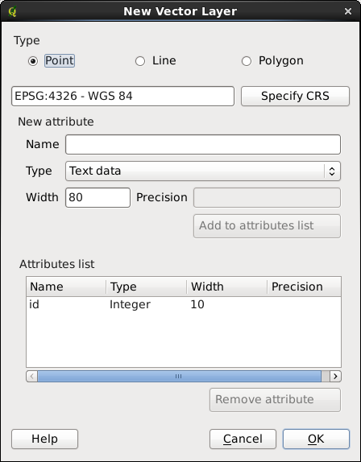
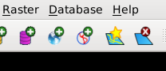
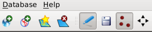

Instructions for creating ADHydro input files

Section I: Acquire National Elevation Dataset (NED) Digital Elevation
Model (DEM) data and National Hydrography Dataset (NHD) data from USGS

1.  NED DEMs and NHD can be downloaded from the USGS national map web
    site. The national map web site has undergone a number of revisions
    since these instructions were created. As such, we have found that
    detailed instructions on how to get the right data from the national
    map web site were quickly obsolete. So we have decided not to
    include detailed instructions for this section.

2.  Download NED DEMs in GridFloat format at your desired resolution
    covering your watershed of interest.

    1.  Alternatively, DEMs from other sources can be used instead.

3.  Download NHD in Shapefile format covering your watershed of
    interest.

Section II: Process raster data

1.  Unzip all of the NED DEM zip files.

2.  Use the following command to build a virtual raster from all of
    these files.

3.  "gdalbuildvrt source.vrt \<list of .flt files\>"

    1.  WARNING: In the zip files I got there were a couple errors in
        the filenames where some of the .flt files were missing the .flt
        extension. Make sure if you do something like \*.flt that it
        actually catches all of the files.

4.  Transform into a sinusoidal projection and merge into a single TIFF.

5.  "gdalwarp -t_srs "+proj=sinu +datum=WGS84 +lon_0=-109 +x_0=20000000
    +y_0=10000000" -r cubicspline source.vrt projected.tif"

    1.  If you are using PROJ.4 from its build directory without
        installing, you may need to put proj-4.8.0/src/.libs into the
        LD_LIBRARY_PATH.

6.  If the raster is big, you may need to split it into tiles. TIFF
    files can be at most 4GB in size. There is a later format called
    BIGTIFF that can be bigger. If projected.tif is larger than 4GB it
    is in the BIGTIFF format. The program TauDEM that you will be using
    can only read the original TIFF file format. It can, however, read
    multiple TIFF files that are tiles covering an area that is bigger
    than what will fit into one TIFF file.

    1.  If projected.tif is less than 4GB you don\'t need to split it at
        all. In that case, skip steps 10 and 11. Create the projected
        directory in step 12. Skip step 13 and instead just move the
        projected.tif file into the projected directory.

7.  First, select the number of tiles you need. You need enough tiles so
    that each one winds up smaller than 4GB. For example, if your
    overall raster is 10GB you need at least 3 tiles. This means you
    could split the raster into 1x3 or 2x2.

8.  Second, calculate the pixel width and height of each tile. Divide
    the size of the original raster in each dimension by the number of
    tile rows or columns and round up. You can find the dimensions of a
    raster by opening it in QGIS and looking at its properties. The
    result is the pixel width and height to use in the gdal_retile
    command

9.  "mkdir projected"

10. "gdal_retile.py -co BIGTIFF=NO -ps \<pixel width\> \<pixel height\>
    -targetDir projected projected.tif

    1.  If you are using GDAL from its build directory without
        installing, you may need to put
        gdal-1.9.2/swig/python/build/lib.linux-x86_64-2.6/osgeo into the
        PYTHONPATH and gdal-1.9.2/.libs into the LD_LIBRARY_PATH.

11. Now you are ready to process the data with TauDEM. Version 5.2 of
    TauDEM can handle data sets tiled across multiple TIFF files. Put
    all of the TIFFs in a directory and put the directory name on the
    command line as you would the file name for the single file version
    of TauDEM. The individual TIFF files must have the file extension
    .tif, not .tiff.

12. The following TauDEM commands are capable of being run in parallel
    with MPI. They can take a while to run so running in parallel is a
    good idea. You may have to modify the exact commands for your
    specific system. If you don\'t have MPI they can still be run
    serially. Just drop the "mpiexec -n 8" from the beginning of each
    command.

13. "mpiexec -n 8 pitremove projected"

14. "mpiexec -n 8 d8flowdir -p projectedp -sd8 projectedsd8 -fel
    projectedfel"

15. "mpiexec -n 8 aread8 -p projectedp -ad8 projectedad8"

16. The previous step computes the contributing area, which is the
    number of pixels whose water flows down slope through each pixel.
    This is an important concept because essentially the definition of a
    stream is pixels with high contributing area.

17. The next step is to select the outlet(s) of the watershed. You can
    have just one outlet, or more than one. Open QGIS and load in the
    TIFF(s) from the directory projectedad8. When you look at this image
    the bright pixels should look like a stream network. In fact, those
    are pixels that TauDEM has determined have a lot of collecting area,
    and thus should be part of the stream network. You will pick the
    outlet(s) from those pixels.

18. Find the furthest downstream pixel for the watershed that you want
    to model. Pick a pixel with high collecting area on the bright line
    in the image. Select the identify tool and click that pixel to see
    its collecting area in pixels. You can double check that the
    collecting area is approximately right if you know the size of the
    watershed that you want to model.

19. You need to make sure the pixel you select does not have edge
    contamination. If a pixel at the edge of the raster should have
    inflow from off the edge of the raster then its contributing area
    value is set to null (no data), and this value gets propagated to
    all downstream pixels. The best way to fix this problem is to start
    with a raster that contains the entire upstream area from the
    outlet(s). If you get to this point in the instructions and the
    pixel you want to use as an outlet has edge contamination you need
    to get more DEM data covering a larger area and go back to the
    beginning of section II and start over processing the raster data.

    1.  It is also possible to turn edge contamination off in TauDEM,
        but that is not recommended.

20. You have to position the outlet(s) precisely because the commands
    that follow will only save data from pixels upstream of the outlet
    pixel(s). Zoom in and make sure you are selecting the specific
    high-contributing area pixel that you want.

1.  Click on new shapefile layer. A dialog will pop up. Specify the CRS
    to be the same as the TIFF(s). Then click ok. Then a file save as
    dialog will pop up. Choose a name and location for the shapefile.
    The name needs to include the .shp extension.

{width="4.4799in"
height="5.7402in"}

{width="2.0799in"
height="0.9in"}

1.  When you create a shape file for the outlet(s) you specify the
    filename with a .shp extension. In addition, there are four
    auxiliary files that are created with extensions .dbf, .prj, .qpj,
    and .shx. If you move the .shp file you need to move the auxiliary
    files along with it.
2.  Click toggle editing and click add feature. Then click on a pixel
    you want to use as an outlet. You may want to zoom way in to make
    sure you click the exact pixel you want. A dialog will pop up asking
    for the id of the point. You don\'t have to give it an id. You can
    just click ok.

{width="2.9902in"
height="0.6402in"}

1.  After adding the outlet(s), select the menu item Layer \> Save
    Edits. Now you can quit out of QGIS and you don\'t need to save the
    project.
2.  "mpiexec -n 8 aread8 -p projectedp -o projectedoutlet.shp -ad8
    projectedad8o"
3.  "mpiexec -n 8 peukerdouglas -fel projectedfel -ss projectedss"
4.  "mpiexec -n 8 aread8 -p projectedp -o projectedoutlet.shp -ad8
    projectedssa -wg projectedss"
5.  Now you need to determine the stream threshold. If a pixel has a
    contributing area above the threshold it is considered part of a
    stream. You could just pick a number. The lower the number the more
    small tributaties are included in the stream network.
6.  Really, you should use hydrological expertise to decide the
    appropriate stream density for your mesh. You will need to try a
    threshold, finish processing to the end of section II, look at the
    resulting stream network, and maybe come back to here and try a
    different threshold.
7.  TauDEM also has a tool called dropanalysis to help you pick a
    threshold. dropanalysis is described next. We have found that
    dropanalysis usually picks a threshold that is too high from a
    hydrological standpoint so we use it as a guide combined with
    hydrological expertise.
8.  For the dropanalysis command you need to pick the parameter values
    at the end of the command line. The first number is the lowest
    threshold to test. The second number is the highest threshold to
    test. The third number is the number of thresholds to test from
    lowest to highest. I don\'t know what the fourth number is. Use zero
    for it. For example, the following command will test 10 thresholds
    from 5 to 500.
9.  "mpiexec -n 8 dropanalysis -p projectedp -fel projectedfel -ad8
    projectedad8 -ssa projectedssa -drp projecteddrp.txt -o
    projectedoutlet.shp -par 5 500 10 0"
10. Dropanalysis will output a bunch of numbers to the console. If your
    window is wide enough not to wrap around you will see that the
    numbers are in the form of a table. The first column of the table is
    the thresholds that are tested. The last column of the table is a
    t-value for a statistical test. You should see the t-values
    increasing as the threshold increases. The t-values will likely
    start out negative so increasing means closer to zero. Dropanalysis
    will also output a final line where it suggests you use the lowest
    threshold for which the t-value is greater than -2.
11. There is a pitfall if no threshold has a t-value greater than -2. In
    that case, dropanalysis will output that the optimum threshold is 0,
    but that is wrong. Re-run dropanalysis with different parameters to
    test larger thresholds until you get a threshold with t-value
    greater than -2.
12. Now run threshold and for the -thresh parameter use the number you
    determined for the stream threshold.
13. "mpiexec -n 8 threshold -ssa projectedssa -src projectedsrc -thresh
    300"
14. "mpiexec -n 8 streamnet -fel projectedfel -p projectedp -ad8
    projectedad8 -src projectedsrc -ord projectedord3 -tree
    projectedtree.dat -coord projectedcoord.dat -net projectednet.shp -w
    projectedw -o projectedoutlet.shp"
15. The streamnet command will create two things of interest. projectedw
    is a raster of the shape of the watershed with each catchment
    labeled with a unique id. projectednet.shp is a shapefile of the
    stream network.

Section III: Process vector data

1.  Unzip all of the hydrography zip files that you downloaded in
    section I.

2.  Reproject the NHD waterbody data with ogr2ogr.

3.  "ogr2ogr -t_srs \"+proj=sinu +datum=WGS84 +lon_0=-109 +x_0=20000000
    +y_0=10000000\" waterbodies.shp \<location of hydrography
    files\>/NHDWaterbody.shp"

4.  Next, you will use the projectedw watershed raster file from
    step 40. You will convert this file from a raster to a shapefile of
    catchment polygons.

5.  If the watershed raster takes up more than one file, create a
    virtual raster like in step 6 and use that as the input file for
    step 48.

6.  Run QGIS.

7.  Select the menu item Raster \> Conversion \> Polygonize (Raster to
    vector). For the input file browse to the projectedw watershed
    raster file created by TauDEM in step 40 or the virtual raster
    created in step 46. For the output file select the name
    "catchments.shp". Set the field name to "Catchment". Check load into
    canvas when finished.

    1.  In version 1.8.0 of QGIS polygonize didn\'t appear in the
        conversion menu, and we couldn\'t find it in any other menu. In
        this case, you need to run gdal_polygonize.py from the command
        line like this:

        1.  "gdal_polygonize.py -8 projectedw/projectedw.vrt -f \"ESRI
            Shapefile\" catchments.shp Catchment Catchment"
        2.  You may need to modify PYTHONPATH and LD_LIBRARY_PATH like
            in step 13.

    2.  The result might have an extra shape surrounding the catchments
        where the no data values were in the raster. I\'ve found that
        this shape gets created if the input is a virtual raster, but
        not if the input is a single TIFF file. Edit the shapefile and
        delete the surrounding shape outside the watershed, if
        applicable.

8.  Exit QGIS.

9.  The waterbody file from step 44, the catchment file from step 48,
    and the stream network file generated by TauDEM in step 40 are
    basically the line segments to use to create a mesh, but they are
    too detailed. Next, use the topological editing feature of ArcGIS to
    eliminate details while preventing gaps or overlaps.

10. Run ArcCatalog.

11. Right click on folder connections and select connect to folder.
    Select the location of your files.

12. Right click on the location in folder connections and select New \>
    File Geodatabase.

13. Right click on the new geodatabase and select New \> Feature
    Dataset\...

14. Name the dataset.

15. Select Add Coordinate System \> Import\...

16. Select one of your shapefiles to supply the coordinate system.

17. Leave the vertical coordinate system as \"No coordinate system.\"

18. Leave the tolerance at the defaults.

19. Repeat steps 54-59 to create second and third datasets that will be
    used later.

20. Right click on the first dataset and select Import \> Feature Class
    (single).

21. For input features select waterbodies.shp. Set output feature class
    to waterbodies.

22. Repeat import feature class for the catchment and stream network
    shapefiles. Import them all into the first dataset. The other two
    datasets will be used later.

23. Right click on the dataset and select New \> Topology\...

24. Set the cluster tolerance to 50 meters.

25. Select all feature classes to be in the topology.

26. Leave all ranks as the default.

27. Add the following rules

    1.  waterbodies Must Not Overlap.
    2.  catchments Must Not Overlap.
    3.  catchments Must Not Have Gaps.

28. Click yes to validate the topology.

29. If your dataset is big, validating the topology might fail.

    1.  In ArcGIS 10:

        1.  It may give an error and leave the topology partially
            validated. You can resolve the validation errors that it
            found so far, but if you then validate the topology again it
            finds a few more errors, but doesn\'t completely validate
            everything. It says the topology is validated, but the area
            that was not validated before doesn\'t get validated. This
            is because it only processed part of the mesh, but marked
            the entire mesh as processed.

        2.  Start by following steps 80-86 to resolve the validation
            errors that it did find.

        3.  Then reset the entire mesh to unprocessed by adding a new
            topology rule and then removing it. Go back to ArcCatalog
            and open the topology by double clicking it. Add a new
            topology rule similar to the ones in step 68, but use a
            different rule. It doesn\'t matter what rule you add. You
            are only adding the rule to reset whether ArcGIS thinks the
            entire mesh is processed. Click OK to get out of all dialog
            boxes, both the dialog for choosing the new rule, and the
            dialog for editing the topology. This will save the topology
            and reset the mesh to unprocessed. Then open the topology
            again and delete the rule you just added.

        4.  Then right click the topology and click validate.

        5.  Even after this, it doesn\'t find all of the errors. There
            are gaps and overlaps that go undetected. The strategy that
            I used is to re-validate the topology over and over again
            fixing the errors each time until it finds no more errors.
            Then add and remove a topology rule to reset the processed
            mask, and validate and re-validate that topology until it
            finds no more errors. Then keep resetting the processed mask
            and validating several more times.

            1.  This method runs into a problem with errors that
                re-appear. The validation algorithm creates a gap or
                overlap, then I merge it into a neighbor, and then when
                the validation algorithm is run again it recreates the
                exact same error, then I merge into the same neighbor,
                and it appears again. The solution to this is when you
                recognize an error re-appearing merge it into a
                different neighbor than you did last time.
            2.  It appears that this method gets closer but never
                resolves all errors.

    2.  In older versions of ArcGIS:

        1.  In ArcCatalog it might just say "Validate Topology failed."
            If you go to ArcMap and validate from the topology toolbar
            it gives an error message with more information, but some of
            that information is wrong. It says it ran out of disk space
            for temporary files in a certain folder, and gives you the
            chance to change the folder. Changing the folder has no
            effect. It always creates temporary files in C:\\Program
            Files\\ArcGIS\\Bin. It also says the temporary files are
            named xx\*.tmp. They are actually named xx\*.s and xx\*.x.
            Also, it doesn\'t really run out of disk space. One of the
            files grows to 2GB, and that appears to be the limit on the
            size of that file even though there is plenty of disk space.
            I have done this on an NTFS file system so the 2GB limit is
            not directly due to the file system. It must be that ArcGIS
            is using an old FAT file system interface or library that
            NTFS is backwards compatible with, but limits file sizes to
            2GB.
        2.  You can get around this limit by validating incrementally,
            but it is somewhat of a pain. In ArcMap on the topology
            toolbar there are options to validate the current selection
            or current extent. You have to experiment to find out what
            is the biggest extent you can validate. When you do this it
            has problems preserving coincident boundaries at the edge of
            the extent where you validate so it can create gaps or
            overlaps.

30. Exit ArcCatalog.

31. Run ArcMap.

32. There will be an initial popup window asking if you want to open an
    existing map or create one from a template. Click cancel and you
    will be started on a blank map.

33. In the menu item Customize \> Toolbars show the editor toolbar,
    advanced editing toolbar, and topology toolbar.

34. On the right edge of the window click the catalog tab, open the
    folder connections, and drag the feature dataset to the lefthand
    pane under layers.

35. In the editor toolbar in the editor menu select start editing.

36. In the topology toolbar select error inspector.

37. In the error inspector pane deselect visible extent only.

38. If in the process of resolving topology errors in steps 80-86 you
    see gaps and overlaps that aren\'t marked as topology errors, you
    should follow step 70 as if the validation had failed even if the
    validation completed without an error message.

39. Select Must Be Larger Than Cluster Tolerance (in the error inspector
    "Show:" box) and click search now.

40. Select all of the errors by clicking the first one and
    shift-clicking the last one.

41. Right click and select delete. This may take a while.

42. In the following steps you will resolve validation errors by merging
    overlaps or gaps into an adjacent shape. When deciding which shape
    to merge into use the following criteria:

    1.  Make shapes contiguous. Try not to do a merge that would make a
        shape have multiple disconnected parts.
    2.  Make catchments connect to channels. Try to give every catchment
        at least one edge connection to a channel.
    3.  Make catchment boundaries be along channels.
    4.  Consider flow paths towards channels.
    5.  Make shapes convex.

43. Select waterbodies -- Must Not Overlap and click search now. If
    there are errors, resolve them by merging the overlap into one of
    the overlapping waterbodies as follows:

    1.  Right click the topology error and select Merge\...
    2.  Select one of the two waterbodies to merge the overlap into.

44. Select catchments -- Must Not Overlap and click search now. If there
    are errors, resolve them by merging the overlap into one of the
    overlapping catchments as follows:

    1.  Right click the topology error and select Merge\...
    2.  Select one of the two catchments to merge the overlap into.

45. Select catchments -- Must Not Have Gaps and click search now. The
    outer boundary of the watershed will show up as an error. That is
    fine. Mark it as an exception. If there are any other errors resolve
    them by merging the gap into one of the neighboring catchments as
    follows:

    1.  Right click the topology error and select Create Feature.
    2.  Select the created feature by clicking it.
    3.  Pick a neighboring catchment to merge into and add it to the
        selection by shift clicking it.
    4.  In the editor toolbar in the editor menu select Merge\...
    5.  Select the neighboring catchment in the merge dialog so that it
        will preserve the catchment number attribute of the neighboring
        catchment and throw away the null attribute of the new feature.
        You can know which is the neighboring catchment in the list
        because when you click on one it flashes in the map display.
    6.  Click OK to merge.

46. Select the menu item Geoprocessing \> Clip. For the input features
    select the waterbodies layer. For the clip features select the
    catchments layer. For the output feature class make sure it is saved
    inside the second dataset that was created in the file geodatabase
    in step 60.

47. Select Geoprocessing \> Search For Tools. Search for symmetrical
    difference and run it. For the input features select the catchments
    layer. For the update features select the clipped waterbodies layer.
    For the output feature class make sure it is saved inside the second
    dataset that was created in the file geodatabase in step 60.

48. Select Geoprocessing \> Intersect. For the input features select the
    streams layer and the symmetrical difference layer. For the output
    feature class make sure it is saved inside the second dataset that
    was created in the file geodatabase in step 60.

49. Right click on the intersected streams layer and select Selection \>
    Select All.

50. On the advanced editing toolbar select split polygons. For the
    target select the clipped waterbodies layer. You will receive a
    warning that no polygons were split. This is fine. You are just
    doing this to make sure the waterbody borders are split to have a
    point in the polygon at any stream intersection. It won\'t actually
    split any polygons.

    1.  If your dataset is big the split polygons action might fail. If
        that happens you need to select a subset area of the streams and
        split polygons, and then select other subsets and split polygons
        until all of the streams are covered. Make sure to overlap the
        boundaries of the subset areas. This also applies to the split
        polygons action in the next step.

51. Select split polygons again. For the target select the symmetrical
    difference layer. This may not generate the same warning that no
    polygons were split.

52. In the editor toolbar in the editor menu select stop editing. Click
    yes to save edits.

53. Exit ArcMap.

54. Run ArcCatalog.

55. Repeat steps 64-86 to create a new topology in the second dataset
    with the clipped waterbody, symmetrical difference, and intersected
    streams feature classes and return to ArcMap and delete any errors.
    For the new topology use the following rules instead of the ones in
    step 68.

    1.  waterbodies Must Not Overlap.
    2.  catchments Must Not Overlap.
    3.  catchments Must Not Overlap With waterbodies.
    4.  You can also include catchments Must Not Have Gaps, but it will
        have an error for every hole where a waterbody was subtracted
        from the catchments. You will need to mark all of these as
        exceptions, and there shouldn\'t be any gaps because of
        validating the previous topology. You can decide whether this
        check is worth it or not.

56. I had problems doing split polygons in the next step. I think it was
    because the topology set a minimum cluster tolerance. To avoid this,
    you need to copy the clipped waterbody, symmetrical difference, and
    intersected streams layers into the third dataset that was created
    in the file geodatabase in step 60. Do this with the copy features
    tool. The destination feature class must have a different name even
    though it is in a different dataset.

57. Redo the split polygons in steps 90-93 on the copied data layers in
    the third dataset.

58. Select Geoprocessing \> Search For Tools. Search for Multipart To
    Singlepart and run it. For the input feature class select the copy
    of the clipped waterbodies layer in the third dataset. For the
    output feature class make sure it is saved inside the third dataset
    that was created in the file geodatabase in step 60.

59. Repeat the Multipart To Singlepart for the copies of the symmetrical
    difference and intersected streams layers in the third dataset.

60. Select Geoprocessing \> Intersect. For the input features select the
    singlepart waterbodies layer twice. For the output feature class
    make sure it is saved inside the third dataset that was created in
    the file geodatabase in step 60. Set Output Type to LINE.

61. Select Geoprocessing \> Intersect. For the input features select the
    singlepart waterbodies layer and the singlepart streams layer. For
    the output feature class make sure it is saved inside the third
    dataset that was created in the file geodatabase in step 60. Set
    Output Type to POINT.

62. Run Multipart to Singlepart for the intersected waterbodies lines
    layer, and intersected waterbodies streams points layer.

63. Right click on the singlepart waterbodies layer and select Data \>
    Export Data\... On output feature class click the browse button.
    Select save as type shapefile. Set the output file name.

64. Repeat export data for the singlepart symmetrical difference layer,
    singlepart streams layer, singlepart intersected waterbodies lines
    layer, and singlepart intersected waterbodies streams points layer.

65. Exit ArcMap.

66. Run QGIS.

67. Now you will use a python script to create input files for triangle
    from these shapefiles.

68. In QGIS select the menu item Plugins \> Python Console.

69. Edit the script create_triangle_files.py to set the location and
    names of the input and output files. The script can be found in the
    scripts directory of the ADHydro distribution.

70. Run the script create_triangle_files.py. Currently QGIS does not
    have a way to load an arbitrary Python script and run it, so you
    will need to copy and paste the script into the python console
    window.

71. Now you will run triangle from the command line to generate the
    mesh.

72. "triangle -pqAjenV mesh.poly"

    1.  There may be lots of warnings about duplicate vertex and
        endpoints of segment are coincident. These can be ignored. If
        your dataset is big it can take triangle a long time just to
        print these out. If you want, you can edit the triangle source
        code to comment out these print statements and recompile.
    2.  If there are overlaps and gaps in the mesh created by a topology
        failure described in step 70 then triangle might crash or go
        into an infinite loop generating tiny triangles in those problem
        areas. The only way I found to get around this is to run
        triangle in the debugger, break in to find what x, y coordinates
        it is getting hung up on and then find that location in ArcGIS
        and fix the gap or overlap by hand.

73. You can view the results with the showme program that comes with
    triangle.

74. You can also analyze the mesh with the program adhydro_mesh_check.
    It will report problems with small triangles and triangles that have
    no catchment label.

    1.  Triangles with no catchment label shouldn\'t occur. They can
        occur if a catchment polygon is bisected by streams, but because
        of the split polygons step there shouldn\'t be any of those
        situations. If there are triangles with no catchment label you
        will need to investigate why.
    2.  Small triangles usually result from sharp angles in the
        catchment polygons. This can be fixed by hand in ArcGIS and then
        return to step 99 and repeat the steps starting from there.

75. Now you will use a python script to extract the z coordinate from
    the DEM for each point in the mesh.

76. Edit the script create_z\_file.py to set the location and names of
    the input and output files. Use the .node file and the original
    non-pit-filled DEM for input. Give the output file a .z extension.

77. []{#anchor}Go back to the QGIS python console and run the script
    create_z\_file.py.

78. Run the program adhydro_channel_preprocessing. Currently you need to
    edit the source code to set the input and output files. This will
    create three files: a .chan.ele file that contains the channel
    elements, a .chan.node file that contains the x,y coordinates of the
    channel nodes, and a .chan.prune file that contains pruned reach
    codes each paired with an unpruned reach code that the pruned reach
    code flows downstream into. The .chan.node file is in the same
    format as a triangle .node file so you can use the same script to
    generate the z coordinates file.

    1.  We found that the values in the shapefiles for link type were
        not consistent across data sources. In Wyoming the values were
        words: \"Ice Mass\", \"LakePond\", \"SwampMarsh\", etc. In
        Colorado the values were numbers: \"378\" for Ice Mass, \"390\"
        for LakePond, \"466\" for SwampMarsh, etc. It seems likely that
        any time you process a mesh in a new political unit you will
        need to figure out what they use for link type and update the
        code of adhydro_channel_preprocessing. You will get an error
        message if the shapefiles use a link type string that is
        unrecognized.

79. Edit the script create_z\_file.py to set the location and names of
    the input and output files. Use the .chan.node file and the original
    non-pit-filled DEM for input. Give the output file a .chan.z
    extension.

80. Go back to the QGIS python console and run the script
    create_z\_file.py.

Section IV: Process parameter data

1.  In this section you will assign parameters like soil and vegetation
    type to mesh elements.

2.  Several of the scripts used in this section have the following
    software dependencies:

    1.  QGIS 2.0+

    2.  Python 2.7

        1.  Numpy
        2.  Pandas
        3.  Shapely
        4.  GeoPandas

3.  If using a non system python for QGIS, make sure you use the same
    Python to install the additional modules. Also make sure the same
    Python install is used to run the scripts described in this
    workflow. On Unix systems, the easiest way to do this is to make
    sure your PATH, LD_LIBRARY_PATH, and PYTHONPATH environment
    variables contain at the beginning of the list the installation
    directory of the Python version you would like to use.

4.  Use pip to install GeoPandas. The rest should be installed as
    dependencies. If pip is not installed, install it first:

    1.  "easy_install pip"
    2.  "pip install git+git://github.com/geopandas/geopandas.git"

5.  Some of the ADHydro scripts have been set up to use QGIS from the
    command line so that they do not have to be invoked from inside an
    open QGIS application. In order for this to work, the scripts
    require the following code:

    1.  from qgis.core import \*
    2.  qgishome = \<QGIS path\>
    3.  app = QgsApplication(\[\], True)
    4.  QgsApplication.setPrefixPath(qgishome, True)
    5.  QgsApplication.initQgis()

6.  \<QGIS path\> must be replaced with the path to QGIS in your system.
    You will need to edit these scripts before you use them to set
    \<QGIS path\>. The scripts that have this are:

    1.  wrf_to_adhydro.py
    2.  parameter_preprocessing.py
    3.  mesh_histogram.py

7.  Before creating the parameter files for a given mesh you need to
    download several kinds of publicly available source data. The
    downloaded source data can be used for processing just one mesh and
    then thrown away, or you can save it to use for multiple meshes. If
    you want to use it for multiple meshes you need to make sure that
    you download data that covers the complete area of all of the meshes
    you will use it for. These next steps can be skipped if you already
    have the downloaded source data saved.

8.  Create a data directory for your project, \<project path\>/data, and
    create the following subdirectories:

    1.  \<project path\>/data/SSURGO
    2.  \<project path\>/data/STATSGO
    3.  \<project path\>/data/Geologic_Units
    4.  \<project path\>/data/NLCD

9.  You will now download SSURGO and STATSGO data by lat/long bounding
    rectangle.

    1.  If you do not know the bounding rectangle of your watershed of
        interest you can get it from the script mesh_outline.py with the
        following command. Once again, the script can be found in the
        scripts directory of the ADHydro distribution.
    2.  "mesh_outline.py -x \<catchment shapefile\>

10. Go to <https://gdg.sc.egov.usda.gov/GDGOrder.aspx>.

11. Under WHERE, change the method for selecting the order area to
    "Order by Bounding Rectangle".

12. Enter the lat/long bounding rectangle. Note: do not use negatives.
    Use the dropdown to select the hemisphere instead.

    1.  It\'s a good idea to have a little buffer area around your
        bounding rectangle. Also, you might have lat/long in decimal
        degrees, while the web form takes degrees, minutes, and seconds.
        The easiest way to deal with both of these issues is to round
        off your lat/long coordinates to a slightly larger bounding box.
        For example, if the western edge of your bounding box is 109.43
        degrees west you could round that to 109.5, which is easy to
        convert to 109 degrees 30 minutes.

13. Click Check Desired Coordinates and verify the bounding box
    visually. Then click Submit Desired Coordinates.

14. Under WHAT, scroll down to Soils, select the following items, then
    click CONTINUE.

    1.  Soil Survey Spatial and Tabular Data (SSURGO 2.2)
    2.  U.S. General Soil Map (STATSGO2) by State

15. Under HOW, leave the INCLUSION to be Extract, and the DELIVERY to be
    Download. Then click CONTINUE.

16. Under WHO, enter your contact information in the form and click
    CONTINUE.

17. Under REVIEW, review your order and click PLACE ORDER.

18. You will receive an email at the email address you provided with
    links to download the data under "Ordered Items". You should have
    two links, one for SSURGO and one for STATSGO. Click each of these
    links to start the download.

19. Once the downloads have finished, move the zip files to their
    respective data directories.

    1.  soils_GSMCLIP_extract to \<project path\>/data/STATSGO
    2.  soils_SSURGSDM_extract to \<project path\>/data/SSURGO

20. Now you will extract the archives and merge the spatial data needed
    for building ADHydro inputs. Run the script prepare_soil_data.py
    with the following command:

    1.  "prepare_soil_data.py -x \<project path\>/data/"

21. Download the latest National Land Cover Database (NLCD) from
    <http://www.mrlc.gov/>. As of this writing, the 2011 dataset is the
    most current, and can be downloaded from
    <http://www.mrlc.gov/nlcd11_data.php>. Make sure you download the
    land cover layer for the conterminous United States.

22. Extract this data to \<project path\>/data/NLCD.

23. Rename the extracted directory to nlcd_2011 (or nlcd\_\<year\> if
    using a different year).

24. Download Geologic Units from
    <http://mrdata.usgs.gov/geology/state/>. Use the Conterminous US
    state geology <https://mrdata.usgs.gov/geology/state/geol_poly.zip>.

25. Extract this dataset to \<project path\>/data/Geologic_Units

26. You are now finished downloading the source data that you will need.
    The steps after this need to be done for each mesh even if you had
    the downloaded source data saved from a previous mesh.

27. Now open the script in the ADHydro scripts directory called
    parameter_preprocessing.py and make sure of the following things:

    1.  Verify the data_path variable is set to \<project\>/data.
    2.  Then verify that the SSURGO, STATSGO, NLCD, and Geologic_Units
        path and shape file variables are correct and that these files
        exist.
    3.  Update input_path to be the directory containing the mesh.1.ele
        and mesh.1.node files created by triangle in step 113.
    4.  Update output_path to be the directory where you want the output
        files to be created. output_path can be the same as input_path.
    5.  Ensure that the qgishome variable is set to point to the
        installed path of the QGIS you are using. We will refer to this
        directory as \<qgis install\>.

28. Now close parameter_preprocessing.py saving any changes, and make
    sure your PYTHONPATH contains \<qgis install\>/share/qgis/python

    1.  i.e. in bash: "export PYTHONPATH=\<qgis
        install\>/share/qgis/python:\$PYTHONPATH"

29. Now run parameter_preprocessing.py

    1.  For large meshes, this can take a while, about 8 hours for the
        Upper Colorado Basin -- 9,186,658 elements -- running on a 16
        core machine with 126 GB memory. It used approximately 80 GB of
        memory at peak.

30. This script will create a lot of intermediate files. The file names
    begin with "element\_". For example,
    "element_cokey_data.msg.0-21731", "element_coord_data.msg.0-21731".
    These files could theoretically be used to recover from a crash by
    restarting partway through the run using the saved intermediate
    values. However, we have not coded up any options to do this. You
    would need to understand the script and edit the code. This
    functionality is really only useful on really large meshes that take
    a very long time to process. So you can delete these files if you
    want.

31. The three files that you need that are created by this processing
    are "mesh.1.geolType", "mesh.1.landCover", and "mesh.1.soilType".

Section V: Precondition the mesh with ADHydro

1.  At this point, you should have files ready to use as ASCII input
    files to the ADHydro simulation code. The following files will be
    read in by ADHydro. These are also listed in the example superfile.

    1.  mesh.1.node
    2.  mesh.1.z
    3.  mesh.1.ele
    4.  mesh.1.neigh
    5.  mesh.1.landCover
    6.  mesh.1.soilType
    7.  mesh.1.geolType
    8.  mesh.1.edge
    9.  mesh.1.chan.node
    10. mesh.1.chan.z
    11. mesh.1.chan.ele
    12. mesh.1.chan.prune

2.  FIXME document remaining steps done with ADHydro

3.  Read ASCII files with mesh massage

4.  Create forcing data.

5.  Do drain-down run.
